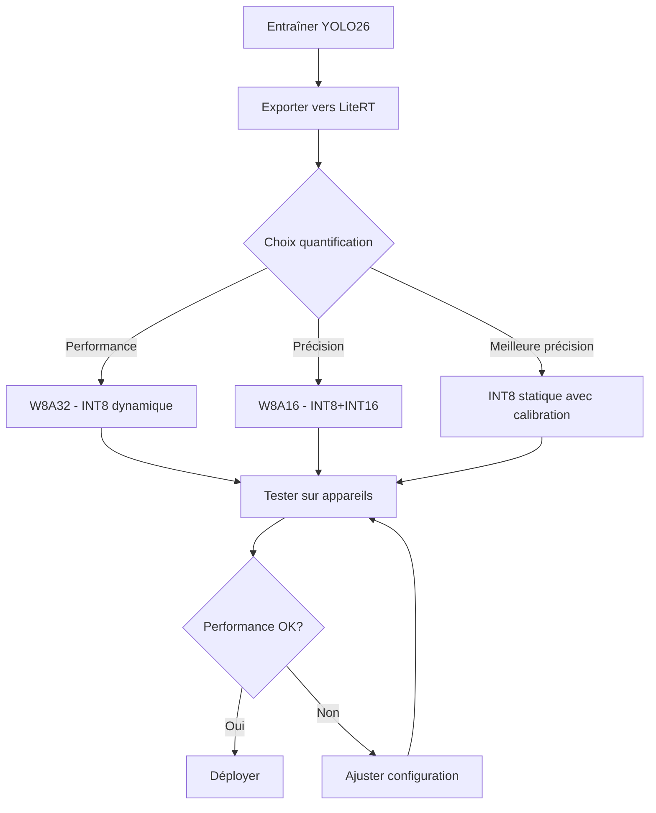

# Déploiement Android avec LiteRT - Guide Complet YOLO26

## Vue d'ensemble

LiteRT (Lite Runtime) est le runtime haute performance de Google pour l'IA sur appareil. C'est la nouvelle génération de TensorFlow Lite, exécutant le même format de modèle `.tflite` pour le déploiement mobile, embarqué, edge et navigateur.

### Avantages principaux
- **Un seul format, toutes les cibles** : Mobile, embarqué, edge et navigateur
- **Accélération matérielle** : XNNPACK CPU, GPU via OpenCL/Metal/WebGPU
- **Quantification flexible** : FP32, INT8 statique/dynamique, W8A16
- **Support multiplateforme** : Android, iOS, Linux embarqué, MCU, navigateur

## Exportation du modèle

### Commandes d'exportation

```python
from ultralytics import YOLO

model = YOLO("yolo26n.pt")

# Export basique (FP32)
model.export(format="litert")  # Crée 'yolo26n.tflite'

# Export INT8 dynamique (recommandé, pas de calibration)
model.export(format="litert", quantize="w8a32")  # Crée 'yolo26n_w8a32.tflite'

# Export INT8 statique (meilleure précision, calibration nécessaire)
model.export(format="litert", quantize=8, data="coco8.yaml")  # Crée 'yolo26n_int8.tflite'

# Export W8A16 (poids INT8 + activations INT16)
model.export(format="litert", quantize="w8a16", data="coco8.yaml")  # Crée 'yolo26n_w8a16.tflite'

# Export avec taille personnalisée
model.export(format="litert", imgsz=320)  # Entrée 320x320
```

```bash
# CLI - Export basique
yolo export model=yolo26n.pt format=litert

# CLI - Export INT8 dynamique
yolo export model=yolo26n.pt format=litert quantize=w8a32

# CLI - Export INT8 statique avec calibration
yolo export model=yolo26n.pt format=litert quantize=8 data=coco8.yaml

# CLI - Export W8A16
yolo export model=yolo26n.pt format=litert quantize=w8a16 data=coco8.yaml
```

### Options d'exportation

| Argument | Type | Défaut | Description |
|----------|------|--------|-------------|
| `format` | `str` | `'litert'` | Format cible (identique à TFLite) |
| `imgsz` | `int` ou `tuple` | `640` | Taille d'entrée |
| `quantize` | `int` ou `str` | `None` | Précision : `8` (INT8), `'w8a16'`, `'w8a32'` |
| `batch` | `int` | `1` | Taille du lot |
| `data` | `str` | `'coco8.yaml'` | Dataset pour calibration INT8 |
| `device` | `str` | `None` | Appareil d'exportation (`cpu`) |

### Validation et inférence

```python
from ultralytics import YOLO

# Charger le modèle exporté
model = YOLO("yolo26n.tflite")

# Inférence
results = model("https://ultralytics.com/images/bus.jpg")

# Validation
metrics = model.val(data="coco8.yaml")
```

## Intégration Kotlin/Java

### Configuration Gradle

```gradle
// build.gradle (app)
dependencies {
    // LiteRT
    implementation 'org.tensorflow:tensorflow-lite:2.14.0'
    implementation 'org.tensorflow:tensorflow-lite-gpu:2.14.0'
    implementation 'org.tensorflow:tensorflow-lite-support:0.4.4'
    implementation 'org.tensorflow:tensorflow-lite-metadata:0.4.4'
}
```

### Code Kotlin - Interprétation LiteRT

```kotlin
import org.tensorflow.lite.Interpreter
import org.tensorflow.lite.gpu.GpuDelegate
import java.io.File
import java.nio.ByteBuffer
import java.nio.ByteOrder

class YOLOLiteRTDetector {
    private var interpreter: Interpreter? = null
    private var gpuDelegate: GpuDelegate? = null
    
    fun loadModel(modelPath: String, useGPU: Boolean = true) {
        val options = Interpreter.Options().apply {
            setNumThreads(4)  // Nombre de cœurs CPU
            
            if (useGPU) {
                try {
                    gpuDelegate = GpuDelegate()
                    addDelegate(gpuDelegate)
                } catch (e: Exception) {
                    println("GPU non disponible, fallback CPU: ${e.message}")
                }
            }
        }
        
        val modelFile = File(modelPath)
        interpreter = Interpreter(modelFile, options)
    }
    
    fun detect(inputBuffer: ByteBuffer): Array<Array<FloatArray>> {
        val interpreter = interpreter ?: throw IllegalStateException("Modèle non chargé")
        
        // Préparer les tenseurs de sortie
        val outputShape = intArrayOf(1, 84, 8400)  // YOLO26 output
        val outputBuffer = Array(1) { Array(84) { FloatArray(8400) } }
        
        // Exécuter l'inférence
        interpreter.run(inputBuffer, outputBuffer)
        
        return outputBuffer
    }
    
    fun close() {
        interpreter?.close()
        gpuDelegate?.close()
    }
}
```

### Prétraitement d'image

```kotlin
import android.graphics.Bitmap
import java.nio.ByteBuffer
import java.nio.ByteOrder

class ImagePreprocessor {
    
    fun preprocessImage(bitmap: Bitmap, inputSize: Int = 640): ByteBuffer {
        val resized = Bitmap.createScaledBitmap(bitmap, inputSize, inputSize, true)
        
        val buffer = ByteBuffer.allocateDirect(1 * inputSize * inputSize * 3 * 4)
        buffer.order(ByteOrder.nativeOrder())
        
        val pixels = IntArray(inputSize * inputSize)
        resized.getPixels(pixels, 0, inputSize, 0, 0, inputSize, inputSize)
        
        for (pixel in pixels) {
            // Normaliser RGB [0, 255] -> [0, 1]
            buffer.putFloat(((pixel shr 16) and 0xFF) / 255.0f)  // R
            buffer.putFloat(((pixel shr 8) and 0xFF) / 255.0f)   // G
            buffer.putFloat((pixel and 0xFF) / 255.0f)            // B
        }
        
        return buffer
    }
}
```

### Post-traitement des résultats

```kotlin
import android.graphics.RectF

data class Detection(
    val bbox: RectF,
    val label: String,
    val confidence: Float
)

class YOLOPostProcessor(private val classNames: List<String>) {
    
    fun processOutput(
        output: Array<Array<FloatArray>>,
        confidenceThreshold: Float = 0.5f,
        iouThreshold: Float = 0.45f
    ): List<Detection> {
        val detections = mutableListOf<Detection>()
        
        // Transposer et décoder les sorties YOLO26
        for (i in 0 until output[0][0].size) {
            val x = output[0][0][i]
            val y = output[0][1][i]
            val w = output[0][2][i]
            val h = output[0][3][i]
            
            // Trouver la classe avec la confiance maximale
            var maxConf = 0f
            var maxClassIdx = 0
            for (j in 4 until output[0].size) {
                if (output[0][j][i] > maxConf) {
                    maxConf = output[0][j][i]
                    maxClassIdx = j - 4
                }
            }
            
            if (maxConf > confidenceThreshold) {
                val bbox = RectF(
                    (x - w / 2),
                    (y - h / 2),
                    (x + w / 2),
                    (y + h / 2)
                )
                detections.add(Detection(bbox, classNames[maxClassIdx], maxConf))
            }
        }
        
        return applyNMS(detections, iouThreshold)
    }
    
    private fun applyNMS(detections: List<Detection>, iouThreshold: Float): List<Detection> {
        val sorted = detections.sortedByDescending { it.confidence }
        val selected = mutableListOf<Detection>()
        
        for (detection in sorted) {
            var shouldSelect = true
            for (selected in selected) {
                if (calculateIoU(detection.bbox, selected.bbox) > iouThreshold) {
                    shouldSelect = false
                    break
                }
            }
            if (shouldSelect) selected.add(detection)
        }
        
        return selected
    }
    
    private fun calculateIoU(box1: RectF, box2: RectF): Float {
        val intersection = RectF()
        intersection.set(
            maxOf(box1.left, box2.left),
            maxOf(box1.top, box2.top),
            minOf(box1.right, box2.right),
            minOf(box1.bottom, box2.bottom)
        )
        
        val intersectionArea = intersection.width() * intersection.height()
        val box1Area = box1.width() * box1.height()
        val box2Area = box2.width() * box2.height()
        val unionArea = box1Area + box2Area - intersectionArea
        
        return if (unionArea > 0) intersectionArea / unionArea else 0f
    }
}
```

## Intégration CameraX

### Configuration CameraX

```kotlin
import androidx.camera.core.*
import androidx.camera.lifecycle.ProcessCameraProvider
import androidx.core.content.ContextCompat
import android.content.Context

class CameraXYOLODetector(private val context: Context) {
    private var imageAnalyzer: ImageAnalysis? = null
    private val yoloDetector = YOLOLiteRTDetector()
    
    fun setupCamera() {
        val cameraProviderFuture = ProcessCameraProvider.getInstance(context)
        
        cameraProviderFuture.addListener({
            val cameraProvider = cameraProviderFuture.get()
            
            // Configurer l'analyse d'image
            imageAnalyzer = ImageAnalysis.Builder()
                .setTargetResolution(android.util.Size(640, 640))
                .setBackpressureStrategy(ImageAnalysis.STRATEGY_KEEP_ONLY_LATEST)
                .build()
            
            imageAnalyzer?.setAnalyzer(ContextCompat.getMainExecutor(context)) { imageProxy ->
                processFrame(imageProxy)
            }
            
            // Sélectionner la caméra arrière
            val cameraSelector = CameraSelector.DEFAULT_BACK_CAMERA
            
            // Lier à la lifecycle
            cameraProvider.bindToLifecycle(
                context as androidx.lifecycle.LifecycleOwner,
                cameraSelector,
                imageAnalyzer
            )
            
        }, ContextCompat.getMainExecutor(context))
    }
    
    private fun processFrame(imageProxy: ImageProxy) {
        val bitmap = imageProxyToBitmap(imageProxy)
        val inputBuffer = ImagePreprocessor().preprocessImage(bitmap)
        
        val output = yoloDetector.detect(inputBuffer)
        val detections = YOLOPostProcessor(getClassNames()).processOutput(output)
        
        // Afficher les résultats sur l'UI
        updateUI(detections)
        
        imageProxy.close()
    }
    
    private fun imageProxyToBitmap(imageProxy: ImageProxy): Bitmap {
        val plane = imageProxy.planes[0]
        val buffer = plane.buffer
        val pixelStride = plane.pixelStride
        val rowStride = plane.rowStride
        val rowPadding = rowStride - pixelStride * imageProxy.width
        
        val bitmap = Bitmap.createBitmap(
            imageProxy.width + rowPadding / pixelStride,
            imageProxy.height,
            Bitmap.Config.ARGB_8888
        )
        bitmap.copyPixelsFromBuffer(buffer)
        
        return Bitmap.createBitmap(bitmap, 0, 0, imageProxy.width, imageProxy.height)
    }
}
```

## Délégués GPU et NNAPI

### Configuration GPU Delegate

```kotlin
import org.tensorflow.lite.gpu.GpuDelegate

class GPUOptimizer {
    
    fun createGpuDelegate(): GpuDelegate? {
        return try {
            GpuDelegate(GpuDelegate.Options().apply {
                setPrecisionLossAllowed(true)  // FP16 pour plus de vitesse
                setInferencePreference(GpuDelegate.Options.INFERENCE_PREFERENCE_FAST_SINGLE_ANSWER)
            })
        } catch (e: Exception) {
            println("GPU Delegate non disponible: ${e.message}")
            null
        }
    }
    
    fun configureInterpreterWithGPU(modelPath: String): Interpreter {
        val options = Interpreter.Options()
        
        val gpuDelegate = createGpuDelegate()
        if (gpuDelegate != null) {
            options.addDelegate(gpuDelegate)
            options.setNumThreads(4)
        } else {
            // Fallback CPU
            options.setNumThreads(Runtime.getRuntime().availableProcessors())
        }
        
        return Interpreter(File(modelPath), options)
    }
}
```

### Configuration NNAPI Delegate

```kotlin
import org.tensorflow.lite.nnapi.NnApiDelegate

class NNAPIOptimizer {
    
    fun createNnApiDelegate(): NnApiDelegate? {
        return try {
            NnApiDelegate(NnApiDelegate.Options().apply {
                setModelToken("yolo26n")
                setAllowFp16(true)  // Autoriser FP16
                setUseNnapiCpu(false)  // Utiliser le NPU hardware
            })
        } catch (e: Exception) {
            println("NNAPI non disponible: ${e.message}")
            null
        }
    }
    
    fun configureInterpreterWithNNAPI(modelPath: String): Interpreter {
        val options = Interpreter.Options()
        
        val nnApiDelegate = createNnApiDelegate()
        if (nnApiDelegate != null) {
            options.addDelegate(nnApiDelegate)
        } else {
            // Fallback CPU avec threads optimisés
            options.setNumThreads(Runtime.getRuntime().availableProcessors())
        }
        
        return Interpreter(File(modelPath), options)
    }
}
```

## Pipeline d'inférence complet

```kotlin
class YOLOPipeline(private val context: Context) {
    private var interpreter: Interpreter? = null
    private val preprocessor = ImagePreprocessor()
    private val postProcessor = YOLOPostProcessor(getClassNames())
    
    fun initialize(
        modelPath: String,
        useGPU: Boolean = true,
        useNNAPI: Boolean = false
    ) {
        val options = Interpreter.Options().apply {
            setNumThreads(4)
            
            when {
                useNNAPI -> {
                    val nnApiDelegate = NNAPIOptimizer().createNnApiDelegate()
                    nnApiDelegate?.let { addDelegate(it) }
                }
                useGPU -> {
                    val gpuDelegate = GPUOptimizer().createGpuDelegate()
                    gpuDelegate?.let { addDelegate(it) }
                }
            }
        }
        
        interpreter = Interpreter(File(modelPath), options)
    }
    
    fun detect(bitmap: Bitmap): List<Detection> {
        val interpreter = interpreter ?: throw IllegalStateException("Non initialisé")
        
        // 1. Prétraitement
        val inputBuffer = preprocessor.preprocessImage(bitmap)
        
        // 2. Inférence
        val output = Array(1) { Array(84) { FloatArray(8400) } }
        interpreter.run(inputBuffer, output)
        
        // 3. Post-traitement
        return postProcessor.processOutput(output)
    }
    
    fun release() {
        interpreter?.close()
        interpreter = null
    }
}
```

## Performances par appareil

### Benchmarks recommandés

| Appareil | Chip | FPS estimé | Notes |
|----------|------|------------|-------|
| Pixel 7/8 | Tensor G2/G3 | 30+ fps | Excellent NNAPI |
| Samsung S23/S24 | Snapdragon 8 Gen 2/3 | 30+ fps | Bon GPU delegate |
| Xiaomi 13/14 | Snapdragon 8 Gen 2 | 25+ fps | GPU disponible |
| Samsung A54/A55 | Exynos 1380 | 20+ fps | Bon compromis |
| Pixel 6a | Tensor G1 | 25+ fps | NNAPI limité |
| Moto G82 | Snapdragon 695 | 15-20 fps | CPU uniquement |

### Optimisations par appareil

```kotlin
class DeviceOptimizer {
    
    fun getOptimalConfiguration(): InferenceConfig {
        val manufacturer = Build.MANUFACTURER
        val model = Build.MODEL
        val sdk = Build.VERSION.SDK_INT
        
        return when {
            // Pixel récent (Tensor G2+)
            manufacturer == "Google" && sdk >= 33 -> InferenceConfig(
                useNNAPI = true,
                useGPU = false,
                threads = 4
            )
            
            // Samsung flagship (Snapdragon 8 Gen)
            manufacturer == "Samsung" && model.contains("S23") -> InferenceConfig(
                useGPU = true,
                useNNAPI = false,
                threads = 4
            )
            
            // Appareils milieu de gamme
            sdk >= 30 -> InferenceConfig(
                useGPU = true,
                useNNAPI = false,
                threads = 2
            )
            
            // Appareils anciens
            else -> InferenceConfig(
                useGPU = false,
                useNNAPI = false,
                threads = 2
            )
        }
    }
    
    data class InferenceConfig(
        val useNNAPI: Boolean,
        val useGPU: Boolean,
        val threads: Int
    )
}
```

## Problèmes courants et solutions

### 1. Erreur "GPU delegate not supported"

**Solution** :
```kotlin
// Vérifier la disponibilité GPU
fun isGpuAvailable(): Boolean {
    return try {
        val delegate = GpuDelegate()
        delegate.close()
        true
    } catch (e: Exception) {
        false
    }
}

// Fallback automatique
val delegate = if (isGpuAvailable()) {
    GpuDelegate()
} else {
    null  // Utiliser CPU
}
```

### 2. Modèle trop volumineux

**Solutions** :
```python
# Réduire la taille avec quantification
model.export(format="litert", quantize="w8a32")  # INT8 dynamique

# Ou réduire la résolution
model.export(format="litert", imgsz=320)
```

### 3. Latence élevée

**Solutions** :
```kotlin
// 1. Utiliser GPU delegate
options.addDelegate(GpuDelegate())

// 2. Réduire le nombre de threads si GPU disponible
options.setNumThreads(2)  // GPU gère le gros du travail

// 3. Optimiser le prétraitement
// Utiliser des bits ByteBuffer déjà alloués
```

### 4. Erreur "FlatBuffer model not valid"

**Solution** :
```python
# Réexporter le modèle
model = YOLO("yolo26n.pt")
model.export(format="litert", quantize=8, data="coco8.yaml")
```

### 5. Mauvaise précision après quantification

**Solution** :
```python
# Utiliser W8A16 pour meilleure précision
model.export(format="litert", quantize="w8a16", data="coco8.yaml")

# Valider
model = YOLO("yolo26n_w8a16.tflite")
metrics = model.val(data="coco8.yaml")
```

## Flux de travail recommandé



## Ressources utiles

- [Documentation LiteRT Android](https://developers.google.com/edge/litert/android)
- [Guide de démarrage rapide TFLite](https://www.tensorflow.org/lite/guide/get_started)
- [Optimisations GPU](https://www.tensorflow.org/lite/performance/delegates)
- [Ultralytics Android App](https://github.com/ultralytics/yolo-android-app)
