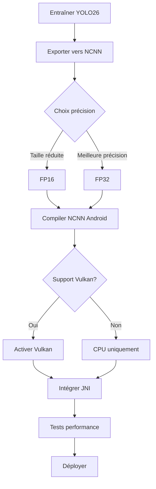

# Déploiement Android avec NCNN - Guide Complet YOLO26

## Vue d'ensemble

NCNN est un framework d'inférence de réseau neuronal haute performance développé par Tencent, optimisé spécifiquement pour les plateformes mobiles. Il offre une excellente performance sur les processeurs mobiles et prend en charge l'accélération GPU via Vulkan.

### Avantages principaux
- **Ultra-léger** : Aucune dépendance externe, binaire minimal
- **Haute performance** : Optimisé pour CPU ARM avec NEON
- **Accélération GPU** : Support Vulkan multi-fournisseurs (AMD, Intel, ARM)
- **Quantification** : Support FP16 pour réduction de taille
- **Multi-plateforme** : Android, iOS, Linux, Windows, macOS

## Exportation du modèle

### Commandes d'exportation

```python
from ultralytics import YOLO

model = YOLO("yolo26n.pt")

# Export basique (FP32)
model.export(format="ncnn")  # Crée '/yolo26n_ncnn_model'

# Export FP16 (réduction taille)
model.export(format="ncnn", quantize=16)  # Crée '/yolo26n_ncnn_model'

# Export avec résolution personnalisée
model.export(format="ncnn", imgsz=320)  # Entrée 320x320
```

```bash
# CLI - Export basique
yolo export model=yolo26n.pt format=ncnn

# CLI - Export FP16
yolo export model=yolo26n.pt format=ncnn quantize=16
```

### Options d'exportation

| Argument | Type | Défaut | Description |
|----------|------|--------|-------------|
| `format` | `str` | `'ncnn'` | Format cible NCNN |
| `imgsz` | `int` ou `tuple` | `640` | Taille d'entrée |
| `quantize` | `int` ou `str` | `None` | `16` (FP16), `32`/non défini (FP32) |
| `batch` | `int` | `1` | Taille du lot |
| `device` | `str` | `None` | Appareil d'exportation |

### Validation et inférence Python

```python
from ultralytics import YOLO

# Charger le modèle exporté
model = YOLO("./yolo26n_ncnn_model")

# Inférence
results = model("https://ultralytics.com/images/bus.jpg")

# Inférence avec GPU Vulkan
results = model("image.jpg", device="vulkan:0")

# Validation
metrics = model.val(data="coco8.yaml")
```

## Compilation Android NDK

### Prérequis

```bash
# Installer les outils nécessaires
# 1. Android NDK r25+ (recommandé r27)
# 2. CMake 3.22+
# 3. Android SDK (API 24+ minimum)
```

### Compilation de NCNN pour Android

```bash
# Cloner NCNN
git clone https://github.com/Tencent/ncnn.git
cd ncnn

# Créer le répertoire de build
mkdir build-android && cd build-android

# Configurer pour Android
cmake -DCMAKE_TOOLCHAIN_FILE=$ANDROID_NDK/build/cmake/android.toolchain.cmake \
      -DANDROID_ABI=arm64-v8a \
      -DANDROID_PLATFORM=android-24 \
      -DANDROID_STL=c++_shared \
      -DCMAKE_BUILD_TYPE=Release \
      -DNCNN_VULKAN=ON \
      -DNCNN_BUILD_EXAMPLES=OFF \
      -DNCNN_BUILD_TOOLS=OFF \
      -DNCNN_BUILD_BENCHMARK=OFF \
      ..

# Compiler
make -j$(nproc)
```

### Script de build automatisé

```bash
#!/bin/bash
# build_ncnn_android.sh

set -e

NDK_PATH=${ANDROID_NDK:-$HOME/Android/Sdk/ndk/27.0.12077973}
NCNN_SOURCE=$HOME/ncnn
OUTPUT_DIR=$HOME/ncnn-android

ABIS=("arm64-v8a" "armeabi-v7a")
ANDROID_API=24

for ABI in "${ABIS[@]}"; do
    echo "Compilation pour $ABI..."
    
    BUILD_DIR="$NCNN_SOURCE/build-android-$ABI"
    mkdir -p "$BUILD_DIR"
    cd "$BUILD_DIR"
    
    cmake -DCMAKE_TOOLCHAIN_FILE="$NDK_PATH/build/cmake/android.toolchain.cmake" \
          -DANDROID_ABI="$ABI" \
          -DANDROID_PLATFORM="android-$ANDROID_API" \
          -DANDROID_STL=c++_shared \
          -DCMAKE_BUILD_TYPE=Release \
          -DNCNN_VULKAN=ON \
          -DNCNN_BUILD_EXAMPLES=OFF \
          -DNCNN_BUILD_TOOLS=OFF \
          "$NCNN_SOURCE"
    
    make -j$(nproc)
    
    # Copier les bibliothèques
    mkdir -p "$OUTPUT_DIR/$ABI"
    cp lib/libncnn.a "$OUTPUT_DIR/$ABI/"
    cp -r "$NCNN_SOURCE/src" "$OUTPUT_DIR/$ABI/include"
    
    echo "$ABI compilé avec succès"
done

echo "Compilation terminée: $OUTPUT_DIR"
```

## Intégration JNI pour NCNN

### Structure du projet

```
app/
├── src/main/
│   ├── java/com/example/yolo/
│   │   └── YOLODetector.kt
│   ├── cpp/
│   │   ├── CMakeLists.txt
│   │   ├── yolo_ncnn.cpp
│   │   └── yolo_ncnn.h
│   └── jniLibs/
│       ├── arm64-v8a/
│       │   ├── libncnn.so
│       │   └── libyolo_ncnn.so
│       └── armeabi-v7a/
│           ├── libncnn.so
│           └── libyolo_ncnn.so
```

### Code C++ - Wrapper JNI

```cpp
// yolo_ncnn.h
#ifndef YOLO_NCNN_H
#define YOLO_NCNN_H

#include <ncnn/net.h>
#include <ncnn/mat.h>
#include <vector>

struct Detection {
    float x, y, w, h;
    float confidence;
    int class_id;
};

class YOLONCNN {
public:
    YOLONCNN();
    ~YOLONCNN();
    
    int load(const char* param_path, const char* bin_path);
    int detect(const unsigned char* pixels, int width, int height, 
               std::vector<Detection>& detections);
    
private:
    ncnn::Net net;
    int input_size = 640;
    float conf_threshold = 0.5f;
    float nms_threshold = 0.45f;
};

#endif
```

```cpp
// yolo_ncnn.cpp
#include "yolo_ncnn.h"
#include <ncnn/cpu.h>
#include <algorithm>

YOLONCNN::YOLONCNN() {
    ncnn::set_cpu_powersave(0);
}

YOLONCNN::~YOLONCNN() {
}

int YOLONCNN::load(const char* param_path, const char* bin_path) {
    int ret = net.load_param(param_path);
    if (ret != 0) return ret;
    
    ret = net.load_model(bin_path);
    return ret;
}

int YOLONCNN::detect(const unsigned char* pixels, int width, int height,
                     std::vector<Detection>& detections) {
    // Convertir en ncnn::Mat
    ncnn::Mat in = ncnn::Mat::from_pixels_resize(
        pixels, ncnn::Mat::PIXEL_BGR2RGB, 
        width, height, input_size, input_size
    );
    
    // Normaliser
    const float mean_vals[3] = {0.0f, 0.0f, 0.0f};
    const float norm_vals[3] = {1.0f/255.0f, 1.0f/255.0f, 1.0f/255.0f};
    in.substract_mean_normalize(mean_vals, norm_vals);
    
    // Inférence
    ncnn::Extractor ex = net.create_extractor();
    ex.input("images", in);
    
    ncnn::Mat out;
    ex.extract("output", out);
    
    // Décoder les résultats
    detections.clear();
    for (int i = 0; i < out.h; i++) {
        const float* values = out.row<float>(i);
        
        float x = values[0];
        float y = values[1];
        float w = values[2];
        float h = values[3];
        
        float max_conf = 0;
        int max_class = 0;
        for (int j = 4; j < out.w; j++) {
            if (values[j] > max_conf) {
                max_conf = values[j];
                max_class = j - 4;
            }
        }
        
        if (max_conf > conf_threshold) {
            Detection det;
            det.x = x - w / 2;
            det.y = y - h / 2;
            det.w = w;
            det.h = h;
            det.confidence = max_conf;
            det.class_id = max_class;
            detections.push_back(det);
        }
    }
    
    // NMS
    std::sort(detections.begin(), detections.end(),
        [](const Detection& a, const Detection& b) {
            return a.confidence > b.confidence;
        });
    
    std::vector<Detection> result;
    for (const auto& det : detections) {
        bool keep = true;
        for (const auto& r : result) {
            float iou = 0;
            // Calculer IoU
            float x1 = std::max(det.x, r.x);
            float y1 = std::max(det.y, r.y);
            float x2 = std::min(det.x + det.w, r.x + r.w);
            float y2 = std::min(det.y + det.h, r.y + r.h);
            
            float intersection = std::max(0.0f, x2 - x1) * std::max(0.0f, y2 - y1);
            float area1 = det.w * det.h;
            float area2 = r.w * r.h;
            float union_area = area1 + area2 - intersection;
            
            if (union_area > 0) {
                iou = intersection / union_area;
            }
            
            if (iou > nms_threshold) {
                keep = false;
                break;
            }
        }
        if (keep) result.push_back(det);
    }
    
    detections = result;
    return 0;
}
```

### Code JNI

```cpp
// yolo_ncnn_jni.cpp
#include <jni.h>
#include <android/bitmap.h>
#include "yolo_ncnn.h"

static YOLONCNN* g_detector = nullptr;

extern "C" {

JNIEXPORT jlong JNICALL
Java_com_example_yolo_YOLODetector_nativeLoad(
    JNIEnv* env, jobject thiz, 
    jstring param_path, jstring bin_path) {
    
    const char* param = env->GetStringUTFChars(param_path, nullptr);
    const char* bin = env->GetStringUTFChars(bin_path, nullptr);
    
    g_detector = new YOLONCNN();
    int ret = g_detector->load(param, bin);
    
    env->ReleaseStringUTFChars(param_path, param);
    env->ReleaseStringUTFChars(bin_path, bin);
    
    if (ret != 0) {
        delete g_detector;
        g_detector = nullptr;
        return -1;
    }
    
    return (jlong)g_detector;
}

JNIEXPORT jobjectArray JNICALL
Java_com_example_yolo_YOLODetector_nativeDetect(
    JNIEnv* env, jobject thiz, 
    jobject bitmap) {
    
    if (!g_detector) return nullptr;
    
    // Convertir Bitmap en buffer
    AndroidBitmapInfo info;
    void* pixels;
    AndroidBitmap_getInfo(env, bitmap, &info);
    AndroidBitmap_lockPixels(env, bitmap, &pixels);
    
    std::vector<Detection> detections;
    g_detector->detect(
        static_cast<const unsigned char*>(pixels),
        info.width, info.height,
        detections
    );
    
    AndroidBitmap_unlockPixels(env, bitmap);
    
    // Créer le tableau Java
    jclass detectionClass = env->FindClass("com/example/yolo/Detection");
    jmethodID constructor = env->GetMethodID(detectionClass, "<init>", "(FFFFIF)V");
    
    jobjectArray result = env->NewObjectArray(
        detections.size(), detectionClass, nullptr);
    
    for (size_t i = 0; i < detections.size(); i++) {
        jobject det = env->NewObject(
            detectionClass, constructor,
            detections[i].x, detections[i].y,
            detections[i].w, detections[i].h,
            detections[i].class_id, detections[i].confidence);
        env->SetObjectArrayElement(result, i, det);
        env->DeleteLocalRef(det);
    }
    
    return result;
}

JNIEXPORT void JNICALL
Java_com_example_yolo_YOLODetector_nativeRelease(
    JNIEnv* env, jobject thiz) {
    if (g_detector) {
        delete g_detector;
        g_detector = nullptr;
    }
}

}
```

### CMakeLists.txt

```cmake
cmake_minimum_required(VERSION 3.22)
project(yolo_ncnn)

# Trouver NCNN
find_package(ncnn REQUIRED)

# Ajouter le library JNI
add_library(yolo_ncnn SHARED
    yolo_ncnn.cpp
    yolo_ncnn_jni.cpp
)

# Lier NCNN
target_link_libraries(yolo_ncnn
    ncnn
    jnigraphics
    log
)
```

### Code Kotlin - Interface JNI

```kotlin
package com.example.yolo

data class Detection(
    val x: Float,
    val y: Float,
    val w: Float,
    val h: Float,
    val classId: Int,
    val confidence: Float
)

class YOLODetector {
    
    companion object {
        init {
            System.loadLibrary("yolo_ncnn")
        }
    }
    
    private external fun nativeLoad(paramPath: String, binPath: String): Long
    private external fun nativeDetect(bitmap: android.graphics.Bitmap): Array<Detection>?
    private external fun nativeRelease()
    
    private var nativeHandle: Long = 0
    
    fun loadModel(paramPath: String, binPath: String): Boolean {
        nativeHandle = nativeLoad(paramPath, binPath)
        return nativeHandle >= 0
    }
    
    fun detect(bitmap: android.graphics.Bitmap): List<Detection> {
        return nativeDetect(bitmap)?.toList() ?: emptyList()
    }
    
    fun release() {
        nativeRelease()
    }
}
```

## Accélération GPU Vulkan

### Configuration Vulkan

```kotlin
class VulkanConfig {
    
    fun checkVulkanSupport(): Boolean {
        return try {
            val ncnn = ncnn.Net()
            ncnn.set_vulkan_device(0)
            true
        } catch (e: Exception) {
            false
        }
    }
    
    fun getAvailableDevices(): List<String> {
        val devices = mutableListOf<String>()
        
        // Numéroter les périphériques Vulkan disponibles
        for (i in 0..9) {
            try {
                val ncnn = ncnn.Net()
                ncnn.set_vulkan_device(i)
                devices.add("vulkan:$i")
            } catch (e: Exception) {
                break
            }
        }
        
        return devices
    }
}
```

### Utilisation Vulkan avec NCNN

```cpp
// Charger et utiliser Vulkan
#include <ncnn/net.h>
#include <ncnn/gpu.h>

int initVulkan() {
    // Initialiser Vulkan
    ncnn::create_gpu_instance();
    
    // Sélectionner le premier périphérique Vulkan
    ncnn::Net net;
    net.set_vulkan_device(0);
    
    // Charger le modèle
    net.load_param("model.param");
    net.load_model("model.bin");
    
    return 0;
}
```

### Benchmark Vulkan vs CPU

```kotlin
class VulkanBenchmark {
    
    fun benchmark(modelPath: String, iterations: Int = 100): BenchmarkResult {
        val cpuTimes = mutableListOf<Long>()
        val gpuTimes = mutableListOf<Long>()
        
        // Test CPU
        val cpuNet = ncnn.Net()
        cpuNet.load_param("$modelPath/model.param")
        cpuNet.load_model("$modelPath/model.bin")
        
        for (i in 0 until iterations) {
            val start = System.nanoTime()
            // Inférence CPU
            val end = System.nanoTime()
            cpuTimes.add(end - start)
        }
        
        // Test GPU Vulkan
        val gpuNet = ncnn.Net()
        gpuNet.set_vulkan_device(0)
        gpuNet.load_param("$modelPath/model.param")
        gpuNet.load_model("$modelPath/model.bin")
        
        for (i in 0 until iterations) {
            val start = System.nanoTime()
            // Inférence GPU
            val end = System.nanoTime()
            gpuTimes.add(end - start)
        }
        
        return BenchmarkResult(
            cpuAvg = cpuTimes.average() / 1_000_000,
            gpuAvg = gpuTimes.average() / 1_000_000,
            speedup = cpuTimes.average() / gpuTimes.average()
        )
    }
    
    data class BenchmarkResult(
        val cpuAvg: Double,
        val gpuAvg: Double,
        val speedup: Double
    )
}
```

## Intégration caméra

```kotlin
import android.camera.core.CameraX
import android.camera.core.ImageAnalysis
import android.camera.core.Preview
import androidx.camera.lifecycle.ProcessCameraProvider
import android.content.Context

class CameraNCNNDetector(private val context: Context) {
    private val detector = YOLODetector()
    
    fun setupCamera() {
        val cameraProviderFuture = ProcessCameraProvider.getInstance(context)
        
        cameraProviderFuture.addListener({
            val cameraProvider = cameraProviderFuture.get()
            
            val imageAnalysis = ImageAnalysis.Builder()
                .setTargetResolution(android.util.Size(640, 640))
                .setBackpressureStrategy(ImageAnalysis.STRATEGY_KEEP_ONLY_LATEST)
                .build()
            
            imageAnalysis.setAnalyzer(
                context.mainExecutor
            ) { imageProxy ->
                processFrame(imageProxy)
            }
            
            val cameraSelector = CameraSelector.DEFAULT_BACK_CAMERA
            
            cameraProvider.bindToLifecycle(
                context as androidx.lifecycle.LifecycleOwner,
                cameraSelector,
                imageAnalysis
            )
            
        }, context.mainExecutor)
    }
    
    private fun processFrame(imageProxy: androidx.camera.core.ImageProxy) {
        val bitmap = imageProxyToBitmap(imageProxy)
        val detections = detector.detect(bitmap)
        
        // Traiter les détections
        updateUI(detections)
        
        imageProxy.close()
    }
}
```

## Optimisation de la taille binaire

### Réduire la taille de NCNN

```cmake
# CMakeLists.txt optimisé
option(NCNN_VULKAN "Activé Vulkan" ON)
option(NCNN_BUILD_EXAMPLES "Compiler les exemples" OFF)
option(NCNN_BUILD_TOOLS "Compiler les outils" OFF)
option(NCNN_BUILD_BENCHMARK "Compiler les benchmarks" OFF)
option(NCNN_BUILD_TESTS "Compiler les tests" OFF)

# Désactiver les fonctionnalités inutiles
set(NCNN_DISABLE_RTTI ON)
set(NCNN_DISABLE_EXCEPTION ON)
```

### Taille typique

| Composant | Taille (arm64-v8a) |
|-----------|-------------------|
| libncnn.so (FP32) | ~1.5 MB |
| libncnn.so (FP16) | ~1.0 MB |
| Modèle param | ~0.5 MB |
| Modèle bin | ~4.5 MB (nano) |
| **Total** | **~7 MB** |

### Optimisations supplémentaires

```bash
# Strip les symboles
$ANDROID_NDK/toolchains/llvm/prebuilt/linux-x86_64/bin/aarch64-linux-android-strip --strip-all libncnn.so

# Compresser avec UPX
upx --best libncnn.so
```

## Comparaison NCNN vs LiteRT

### Quand choisir NCNN ?

| Critère | NCNN | LiteRT |
|---------|------|--------|
| **Taille binaire** | Plus petit (~1 MB) | Plus grand (~2 MB) |
| **Performance CPU** | Excellent (ARM NEON) | Bon (XNNPACK) |
| **GPU** | Vulkan (multi-fournisseur) | OpenCL/Metal |
| **NNAPI/NPU** | Non | Oui |
| **Quantification** | FP16 uniquement | INT8, W8A16, etc. |
| **Navigateur** | Non | Oui (LiteRT.js) |
| **Facilité d'utilisation** | Plus complexe | Plus simple |
| **Communauté** | Tencent + communauté | Google + TensorFlow |
| **Documentation** | Bonne | Excellente |

### Scénarios recommandés

**Choisir NCNN quand** :
- Taille binaire critique
- Pas besoin de quantification INT8
- GPU Vulkan disponible et souhaité
- Développement bas niveau souhaité
- Appareils très anciens (Android 5.0+)

**Choisir LiteRT quand** :
- Facilité d'intégration importante
- Quantification INT8 nécessaire
- Support NPU/NNAPI souhaité
- Déploiement multi-plateforme (y compris web)
- Documentation et support communauté importants

### Migration de NCNN vers LiteRT

```kotlin
// Avant (NCNN)
class NCNNDetector {
    private val net = ncnn.Net()
    
    fun detect(bitmap: Bitmap): List<Detection> {
        val mat = ncnn.Mat.from_pixels(bitmap, ncnn.Mat.PIXEL_RGB, 640, 640)
        // ... inférence NCNN
    }
}

// Après (LiteRT)
class LiteRTDetector {
    private var interpreter: Interpreter? = null
    
    fun detect(bitmap: Bitmap): List<Detection> {
        val buffer = preprocessImage(bitmap)
        val output = Array(1) { Array(84) { FloatArray(8400) } }
        interpreter?.run(buffer, output)
        // ... post-traitement
    }
}
```

## Problèmes courants et solutions

### 1. Erreur "Vulkan not available"

**Solution** :
```kotlin
// Vérifier le support Vulkan
fun isVulkanSupported(): Boolean {
    return try {
        val ncnn = ncnn.Net()
        ncnn.set_vulkan_device(0)
        ncnn.destroy()
        true
    } catch (e: Exception) {
        false
    }
}

// Fallback CPU si Vulkan non disponible
if (isVulkanSupported()) {
    net.set_vulkan_device(0)
} else {
    // Utiliser CPU
}
```

### 2. Erreur de compilation NDK

**Solution** :
```bash
# Vérifier la version NDK
$ANDROID_NDK/ndk-build --version

# Utiliser la bonne version (r25+ recommandé)
export ANDROID_NDK=$HOME/Android/Sdk/ndk/27.0.12077973
```

### 3. Mémoire insuffisante

**Solutions** :
```kotlin
// 1. Réduire la résolution d'entrée
model.export(format="ncnn", imgsz=320)

// 2. Utiliser FP16
model.export(format="ncnn", quantize=16)

// 3. Libérer les ressources
net.clear()  // Après chaque inférence
```

### 4. Mauvaise performance sur vieux appareils

**Solutions** :
```kotlin
// Désactiver Vulkan sur appareils anciens
if (Build.VERSION.SDK_INT < 24) {
    // CPU uniquement
    net.set_num_threads(2)
} else {
    // Essayer Vulkan
    if (isVulkanSupported()) {
        net.set_vulkan_device(0)
    }
}
```

### 5. Précision réduite avec FP16

**Solution** :
```python
# Utiliser FP32 si la précision est critique
model.export(format="ncnn", quantize=32)  # ou sans quantize

# Valider la précision
model = YOLO("./yolo26n_ncnn_model")
metrics = model.val(data="coco8.yaml")
```

## Flux de travail recommandé



## Ressources utiles

- [Documentation officielle NCNN](https://ncnn.readthedocs.io/)
- [GitHub NCNN](https://github.com/Tencent/ncnn)
- [Guide de compilation Android](https://github.com/Tencent/ncnn/wiki/how-to-build#build-for-android)
- [Exemples NCNN Android](https://github.com/Tencent/ncnn/tree/master/examples)
