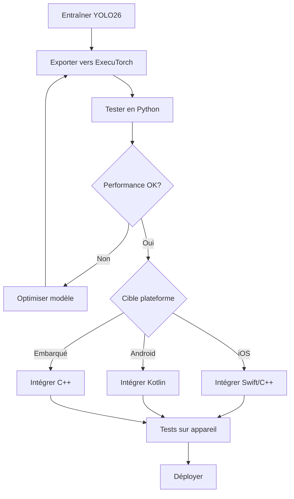

# Déploiement Cross-plateforme avec ExecuTorch - Guide Complet YOLO26

## Vue d'ensemble

ExecuTorch est la solution de PyTorch pour l'inférence sur appareil (edge computing). Il permet de déployer des modèles YOLO26 sur iOS, Android et Linux embarqué avec des performances optimisées et une intégration native PyTorch.

### Avantages principaux
- **Intégration PyTorch native** : Pas de conversion de format nécessaire
- **Format portable** : Fichiers `.pte` légers et rapides à charger
- **Backend XNNPACK** : Inférence CPU optimisée pour mobile
- **Multi-plateforme** : iOS, Android, Linux embarqué
- **Efficacité mémoire** : Gestion optimisée pour appareils à RAM limitée

## Exportation du modèle

### Prérequis

```bash
# Python 3.10-3.13 requis
python --version  # Vérifier la version

# Installer les dépendances
pip install ultralytics
pip install executorch  # Inclut XNNPACK backend
```

### Commandes d'exportation

```python
from ultralytics import YOLO

model = YOLO("yolo26n.pt")

# Export basique (FP32 uniquement)
model.export(format="executorch")  # Crée 'yolo26n_executorch_model'

# Export avec résolution personnalisée
model.export(format="executorch", imgsz=320)  # Entrée 320x320

# Export pour batch size spécifique
model.export(format="executorch", batch=2)  # Traite 2 images
```

```bash
# CLI - Export basique
yolo export model=yolo26n.pt format=executorch

# CLI - Export avec résolution
yolo export model=yolo26n.pt format=executorch imgsz=320
```

### Structure de sortie

```
yolo26n_executorch_model/
├── model.pte               # Fichier modèle ExecuTorch
└── metadata.yaml           # Métadonnées (classes, taille image, etc.)
```

### Options d'exportation

| Argument | Type | Défaut | Description |
|----------|------|--------|-------------|
| `format` | `str` | `'executorch'` | Format cible ExecuTorch |
| `imgsz` | `int` ou `tuple` | `640` | Taille d'entrée |
| `quantize` | `int` ou `str` | `None` | FP32 uniquement actuellement |
| `batch` | `int` | `1` | Taille du lot |
| `device` | `str` | `None` | Appareil d'exportation |

### Validation et inférence Python

```python
from ultralytics import YOLO

# Charger le modèle exporté
model = YOLO("yolo26n_executorch_model")

# Inférence
results = model("https://ultralytics.com/images/bus.jpg")

# Validation
metrics = model.val(data="coco8.yaml")
```

## Intégration iOS (Swift/C++)

### Configuration Xcode

```ruby
# Podfile
platform :ios, '15.0'

target 'YourApp' do
  pod 'ExecuTorch', '~> 0.1'
  pod 'ExecuTorchXNNPACKBackend', '~> 0.1'
end
```

### Code Swift - Chargement et inférence

```swift
import ExecuTorch

class YOLOExecuTorchDetector {
    private var module: Module?
    
    func loadModel(modelPath: String) {
        do {
            // Charger le modèle .pte
            module = try Module(modelPath: modelPath)
            print("Modèle ExecuTorch chargé avec succès")
        } catch {
            print("Erreur de chargement: \(error)")
        }
    }
    
    func detect(image: CGImage) -> [Detection]? {
        guard let module = module else { return nil }
        
        // Prétraiter l'image
        let inputTensor = preprocessImage(image)
        
        // Exécuter l'inférence
        let outputs = try? module.forward(inputTensor)
        
        // Post-traiter les résultats
        return postprocessOutputs(outputs)
    }
    
    private func preprocessImage(_ image: CGImage) -> Tensor {
        // Redimensionner à 640x640
        let width = 640
        let height = 640
        
        // Créer le buffer d'entrée
        let pixelCount = width * height * 3
        var buffer = [Float](repeating: 0, count: pixelCount)
        
        // Extraire et normaliser les pixels
        // ... code de prétraitement
        
        return Tensor(shape: [1, 3, height, width], data: buffer)
    }
    
    private func postprocessOutputs(_ outputs: [Tensor]?) -> [Detection]? {
        guard let outputs = outputs,
              let output = outputs.first else {
            return nil
        }
        
        var detections: [Detection] = []
        let data = output.data as! [Float]
        
        // Décoder les sorties YOLO26
        for i in stride(from: 0, to: data.count, by: 84) {
            let x = data[i]
            let y = data[i + 1]
            let w = data[i + 2]
            let h = data[i + 3]
            
            var maxConf: Float = 0
            var maxClassIdx = 0
            
            for j in 4..<84 {
                if data[i + j] > maxConf {
                    maxConf = data[i + j]
                    maxClassIdx = j - 4
                }
            }
            
            if maxConf > 0.5 {
                let detection = Detection(
                    x: x - w / 2,
                    y: y - h / 2,
                    w: w,
                    h: h,
                    classId: maxClassIdx,
                    confidence: maxConf
                )
                detections.append(detection)
            }
        }
        
        return detections
    }
}

struct Detection {
    let x: Float
    let y: Float
    let w: Float
    let h: Float
    let classId: Int
    let confidence: Float
}
```

### Intégration Camera iOS

```swift
import AVFoundation
import CoreImage

class RealTimeExecuTorchDetector: NSObject, AVCaptureVideoDataOutputSampleBufferDelegate {
    private let captureSession = AVCaptureSession()
    private let detector = YOLOExecuTorchDetector()
    private let processingQueue = DispatchQueue(label: "com.yolo.processing")
    
    func setup() {
        // Configurer la caméra
        captureSession.sessionPreset = .high
        
        guard let camera = AVCaptureDevice.default(.builtInWideAngleCamera, for: .video, position: .back),
              let input = try? AVCaptureDeviceInput(device: camera) else {
            return
        }
        
        captureSession.addInput(input)
        
        let videoOutput = AVCaptureVideoDataOutput()
        videoOutput.setSampleBufferDelegate(self, queue: processingQueue)
        captureSession.addOutput(videoOutput)
        
        // Charger le modèle
        if let modelPath = Bundle.main.path(forResource: "yolo26n", ofType: "pte") {
            detector.loadModel(modelPath: modelPath)
        }
        
        captureSession.startRunning()
    }
    
    func captureOutput(_ output: AVCaptureOutput, 
                      didOutput sampleBuffer: CMSampleBuffer, 
                      from connection: AVCaptureConnection) {
        guard let imageBuffer = CMSampleBufferGetImageBuffer(sampleBuffer) else { return }
        
        let ciImage = CIImage(cvImageBuffer: imageBuffer)
        let context = CIContext()
        
        guard let cgImage = context.createCGImage(ciImage, from: ciImage.extent) else { return }
        
        if let detections = detector.detect(image: cgImage) {
            DispatchQueue.main.async {
                self.updateUI(with: detections)
            }
        }
    }
    
    private func updateUI(with detections: [Detection]) {
        // Mettre à jour l'interface avec les détections
    }
}
```

## Intégration Android (Kotlin)

### Configuration Gradle

```gradle
// build.gradle (app)
dependencies {
    // ExecuTorch
    implementation 'org.pytorch:executorch-android:0.1.0'
    implementation 'org.pytorch:executorch-xnnpack-backend:0.1.0'
}
```

### Code Kotlin - Chargement et inférence

```kotlin
import org.pytorch.executorch.EValue
import org.pytorch.executorch.Module
import org.pytorch.executorch.Tensor
import android.graphics.Bitmap

class YOLOExecuTorchDetector {
    private var module: Module? = null
    
    fun loadModel(modelPath: String): Boolean {
        return try {
            module = Module.load(modelPath)
            true
        } catch (e: Exception) {
            println("Erreur de chargement: ${e.message}")
            false
        }
    }
    
    fun detect(bitmap: Bitmap): List<Detection> {
        val module = module ?: return emptyList()
        
        // Prétraiter l'image
        val inputTensor = preprocessImage(bitmap)
        val inputEValue = EValue.from(inputTensor)
        
        // Inférence
        val outputs = module.forward(inputEValue)
        
        // Post-traiter
        return postprocessOutputs(outputs)
    }
    
    private fun preprocessImage(bitmap: Bitmap): Tensor {
        val width = 640
        val height = 640
        
        // Redimensionner
        val resized = Bitmap.createScaledBitmap(bitmap, width, height, true)
        
        // Convertir en tensor
        val buffer = FloatArray(3 * width * height)
        val pixels = IntArray(width * height)
        resized.getPixels(pixels, 0, width, 0, 0, width, height)
        
        for (i in pixels.indices) {
            val pixel = pixels[i]
            // Normaliser RGB [0, 255] -> [0, 1]
            buffer[i * 3] = ((pixel shr 16) and 0xFF) / 255.0f
            buffer[i * 3 + 1] = ((pixel shr 8) and 0xFF) / 255.0f
            buffer[i * 3 + 2] = (pixel and 0xFF) / 255.0f
        }
        
        return Tensor.fromBlob(buffer, longArrayOf(1, 3, height.toLong(), width.toLong()))
    }
    
    private fun postprocessOutputs(outputs: Array<EValue>): List<Detection> {
        val outputTensor = outputs[0].toTensor()
        val data = outputTensor.dataAsFloatArray
        
        val detections = mutableListOf<Detection>()
        
        // Décoder les sorties YOLO26
        var i = 0
        while (i < data.size) {
            val x = data[i]
            val y = data[i + 1]
            val w = data[i + 2]
            val h = data[i + 3]
            
            var maxConf = 0f
            var maxClassIdx = 0
            
            for (j in 4 until 84) {
                if (data[i + j] > maxConf) {
                    maxConf = data[i + j]
                    maxClassIdx = j - 4
                }
            }
            
            if (maxConf > 0.5f) {
                detections.add(Detection(
                    x = x - w / 2,
                    y = y - h / 2,
                    w = w,
                    h = h,
                    classId = maxClassIdx,
                    confidence = maxConf
                ))
            }
            
            i += 84
        }
        
        return detections
    }
    
    fun release() {
        module?.close()
        module = null
    }
}

data class Detection(
    val x: Float,
    val y: Float,
    val w: Float,
    val h: Float,
    val classId: Int,
    val confidence: Float
)
```

### Intégration CameraX Android

```kotlin
import androidx.camera.core.*
import androidx.camera.lifecycle.ProcessCameraProvider
import android.content.Context

class CameraExecuTorchDetector(private val context: Context) {
    private val detector = YOLOExecuTorchDetector()
    
    fun setupCamera() {
        val cameraProviderFuture = ProcessCameraProvider.getInstance(context)
        
        cameraProviderFuture.addListener({
            val cameraProvider = cameraProviderFuture.get()
            
            val imageAnalysis = ImageAnalysis.Builder()
                .setTargetResolution(android.util.Size(640, 640))
                .setBackpressureStrategy(ImageAnalysis.STRATEGY_KEEP_ONLY_LATEST)
                .build()
            
            imageAnalysis.setAnalyzer(context.mainExecutor) { imageProxy ->
                processFrame(imageProxy)
            }
            
            val cameraSelector = CameraSelector.DEFAULT_BACK_CAMERA
            
            cameraProvider.bindToLifecycle(
                context as androidx.lifecycle.LifecycleOwner,
                cameraSelector,
                imageAnalysis
            )
            
        }, context.mainExecutor)
        
        // Charger le modèle
        val modelPath = copyModelToInternalStorage()
        detector.loadModel(modelPath)
    }
    
    private fun processFrame(imageProxy: ImageProxy) {
        val bitmap = imageProxyToBitmap(imageProxy)
        val detections = detector.detect(bitmap)
        
        updateUI(detections)
        imageProxy.close()
    }
    
    private fun copyModelToInternalStorage(): String {
        val modelFile = context.getDir("models", Context.MODE_PRIVATE)
        val modelPath = "${modelFile.absolutePath}/yolo26n.pte"
        
        // Copier depuis les assets si nécessaire
        if (!java.io.File(modelPath).exists()) {
            context.assets.open("yolo26n.pte").use { input ->
                java.io.FileOutputStream(modelPath).use { output ->
                    input.copyTo(output)
                }
            }
        }
        
        return modelPath
    }
}
```

## Code C++ partagé

### Structure du projet

```
shared/
├── CMakeLists.txt
├── yolo_executorch.h
├── yolo_executorch.cpp
├── preprocessing.h
├── preprocessing.cpp
├── postprocessing.h
└── postprocessing.cpp
```

### Code C++ - Wrapper ExecuTorch

```cpp
// yolo_executorch.h
#ifndef YOLO_EXECUTORCH_H
#define YOLO_EXECUTORCH_H

#include <executorch/extension/module/module.h>
#include <executorch/extension/tensor/tensor.h>
#include <vector>
#include <string>

struct Detection {
    float x, y, w, h;
    float confidence;
    int class_id;
};

class YOLOExecuTorch {
public:
    YOLOExecuTorch();
    ~YOLOExecuTorch();
    
    bool load(const std::string& model_path);
    std::vector<Detection> detect(const float* input_data, 
                                  int width, int height);
    
private:
    std::unique_ptr<executorch::extension::Module> module_;
    int input_size_ = 640;
    float conf_threshold_ = 0.5f;
    float nms_threshold_ = 0.45f;
};

#endif
```

```cpp
// yolo_executorch.cpp
#include "yolo_executorch.h"
#include <algorithm>

YOLOExecuTorch::YOLOExecuTorch() {}

YOLOExecuTorch::~YOLOExecuTorch() {}

bool YOLOExecuTorch::load(const std::string& model_path) {
    try {
        module_ = std::make_unique<executorch::extension::Module>(model_path);
        return true;
    } catch (const std::exception& e) {
        return false;
    }
}

std::vector<Detection> YOLOExecuTorch::detect(const float* input_data,
                                               int width, int height) {
    if (!module_) return {};
    
    // Créer le tenseur d'entrée
    auto input_tensor = executorch::extension::from_blob(
        input_data, {1, 3, input_size_, input_size_}
    );
    
    // Exécuter l'inférence
    const auto result = module_->forward(input_tensor);
    
    if (!result.ok()) return {};
    
    // Extraire les résultats
    const auto& output = result->at(0).toTensor();
    const float* output_data = output.const_data_ptr<float>();
    
    std::vector<Detection> detections;
    
    // Décoder les sorties YOLO26
    int num_detections = output.size(1) / 84;
    
    for (int i = 0; i < num_detections; i++) {
        float x = output_data[i * 84 + 0];
        float y = output_data[i * 84 + 1];
        float w = output_data[i * 84 + 2];
        float h = output_data[i * 84 + 3];
        
        float max_conf = 0;
        int max_class = 0;
        
        for (int j = 4; j < 84; j++) {
            float conf = output_data[i * 84 + j];
            if (conf > max_conf) {
                max_conf = conf;
                max_class = j - 4;
            }
        }
        
        if (max_conf > conf_threshold_) {
            Detection det;
            det.x = x - w / 2;
            det.y = y - h / 2;
            det.w = w;
            det.h = h;
            det.confidence = max_conf;
            det.class_id = max_class;
            detections.push_back(det);
        }
    }
    
    // Trier par confiance
    std::sort(detections.begin(), detections.end(),
        [](const Detection& a, const Detection& b) {
            return a.confidence > b.confidence;
        });
    
    return detections;
}
```

### Prétraitement C++

```cpp
// preprocessing.h
#ifndef PREPROCESSING_H
#define PREPROCESSING_H

#include <vector>
#include <cstdint>

class Preprocessor {
public:
    static std::vector<float> preprocessImage(
        const uint8_t* pixels, int width, int height, int target_size = 640
    );
    
    static std::vector<float> normalize(
        const std::vector<float>& pixels
    );
};

#endif
```

```cpp
// preprocessing.cpp
#include "preprocessing.h"

std::vector<float> Preprocessor::preprocessImage(
    const uint8_t* pixels, int width, int height, int target_size
) {
    std::vector<float> buffer(3 * target_size * target_size);
    
    // Redimensionner et normaliser
    float x_scale = (float)width / target_size;
    float y_scale = (float)height / target_size;
    
    for (int y = 0; y < target_size; y++) {
        for (int x = 0; x < target_size; x++) {
            int src_x = (int)(x * x_scale);
            int src_y = (int)(y * y_scale);
            
            int src_idx = (src_y * width + src_x) * 3;
            int dst_idx = (y * target_size + x) * 3;
            
            // Normaliser [0, 255] -> [0, 1]
            buffer[dst_idx + 0] = pixels[src_idx + 0] / 255.0f;
            buffer[dst_idx + 1] = pixels[src_idx + 1] / 255.0f;
            buffer[dst_idx + 2] = pixels[src_idx + 2] / 255.0f;
        }
    }
    
    return buffer;
}

std::vector<float> Preprocessor::normalize(const std::vector<float>& pixels) {
    std::vector<float> normalized(pixels.size());
    
    // Mean et std de ImageNet (si nécessaire)
    const float mean[3] = {0.485f, 0.456f, 0.406f};
    const float std[3] = {0.229f, 0.224f, 0.225f};
    
    for (size_t i = 0; i < pixels.size(); i += 3) {
        normalized[i + 0] = (pixels[i + 0] - mean[0]) / std[0];
        normalized[i + 1] = (pixels[i + 1] - mean[1]) / std[1];
        normalized[i + 2] = (pixels[i + 2] - mean[2]) / std[2];
    }
    
    return normalized;
}
```

## Backend XNNPACK

### Optimisations XNNPACK

```cpp
// Configuration XNNPACK pour mobile
#include <executorch/backends/xnnpack/runtime/XNNPACKBackend.h>

void configureXNNPACK() {
    // XNNPACK est configuré automatiquement lors de l'exportation
    // Le backend optimise automatiquement pour le CPU cible
    
    // Options disponibles lors de l'exportation Python :
    // model.export(format="executorch")  // XNNPACK par défaut
}
```

### Benchmarks XNNPACK

| Appareil | CPU | YOLO26n (ms) | YOLO26s (ms) |
|----------|-----|--------------|--------------|
| Raspberry Pi 5 | BCM2712 | 142 | 376 |
| iPhone 14 | A15 | ~50 | ~120 |
| Pixel 7 | Tensor G2 | ~60 | ~150 |
| Samsung S23 | Snapdragon 8 Gen 2 | ~45 | ~110 |

## Limitations actuelles

### 1. FP32 uniquement

```python
# Actuellement, ExecuTorch n'exporte qu'en FP32
model.export(format="executorch", quantize=8)  # Ignoré
model.export(format="executorch", quantize=16) # Ignoré

# Future support prévu pour :
# - INT8 statique/dynamique
# - FP16
# - W8A16
```

### 2. Taille du modèle

```
# Tailles typiques pour YOLO26n :
# PyTorch:     5.3 MB
# ExecuTorch:  9.4 MB (+77%)
# CoreML INT8: ~3 MB
# LiteRT INT8: ~4 MB
```

### 3. Fonctionnalités manquantes

- Pas de support GPU natif (Metal/Vulkan) - XNNPACK CPU uniquement
- Pas de quantification intégrée
- Communauté plus petite que LiteRT/NCNN

### 4. Comparaison des temps d'inférence

| Format | Raspberry Pi 5 | iPhone 14 | Pixel 7 |
|--------|----------------|-----------|---------|
| PyTorch | 314 ms | ~200 ms | ~180 ms |
| ExecuTorch | 142 ms | ~50 ms | ~60 ms |
| CoreML | N/A | **3.8 ms** | N/A |
| LiteRT | ~200 ms | ~80 ms | ~70 ms |

## Comparaison avec formats natifs

### iOS - ExecuTorch vs CoreML

```swift
// CoreML - Recommandé pour iOS
let config = MLModelConfiguration()
config.computeUnits = .cpuAndNeuralEngine  // Neural Engine
// Résultat : 3.8 ms sur iPhone 17 Pro

// ExecuTorch - Alternative PyTorch
let module = Module(modelPath: "model.pte")
// Résultat : ~50 ms sur iPhone 14 (CPU uniquement)
```

### Android - ExecuTorch vs LiteRT

```kotlin
// LiteRT - Recommandé pour Android
val options = Interpreter.Options()
options.addDelegate(GpuDelegate())  // GPU delegate
// Résultat : ~70 ms avec GPU

// ExecuTorch - Alternative PyTorch
val module = Module.load("model.pte")
// Résultat : ~60 ms (XNNPACK CPU)
```

### Quand choisir ExecuTorch ?

**Choisir ExecuTorch quand** :
- Projet déjà basé sur PyTorch
- Équipe familière avec l'écosystème PyTorch
- Besoin de code C++ partagé multi-plateforme
- Développement expérimental/recherche

**Choisir le format natif quand** :
- Performance maximale requise
- Intégration matérielle spécifique (Neural Engine, NPU)
- Production à grande échelle
- Écosystème mature et support mature

## Optimisations des performances

### Réduire la taille du modèle

```python
# 1. Utiliser des modèles plus petits
model = YOLO("yolo26n.pt")  # Nano (smallest)

# 2. Réduire la résolution
model.export(format="executorch", imgsz=320)

# 3. Optimiser lors du build C++
# Compiler avec -Os au lieu de -O2
```

### Optimiser l'inférence

```cpp
// 1. Utiliser le bon nombre de threads
module_->set_num_threads(4);  // Nombre de cœurs CPU

// 2. Pré-allouer les buffers
std::vector<float> input_buffer(3 * 640 * 640);

// 3. Réduire les copies mémoire
auto input_tensor = executorch::extension::from_blob(
    input_buffer.data(), {1, 3, 640, 640}
);
```

### Gestion de la mémoire

```swift
// iOS - Gestion mémoire
class MemoryManager {
    func optimizeMemory() {
        // 1. Libérer les modèles non utilisés
        // 2. Utiliser des pools d'objets
        // 3. Éviter les allocations dans la boucle d'inférence
    }
}
```

## Dépannage

### Erreur "Python version error"

```bash
# ExecuTorch nécessite Python 3.10-3.13
python --version

# Utiliser pyenv ou conda
pyenv install 3.11.0
pyenv local 3.11.0

# Ou conda
conda create -n executorch python=3.11
conda activate executorch
```

### Erreur "Export fails"

```bash
# Mettre à jour executorch
pip install --upgrade executorch

# Réinstaller
pip install executorch --force-reinstall
```

### Erreur "Import errors"

```python
# Vérifier l'installation
import executorch
print(executorch.__version__)

# Réinstaller si nécessaire
pip install executorch --force-reinstall --no-cache-dir
```

### Modèle trop lent

```python
# 1. Vérifier que XNNPACK est activé
# (activé par défaut lors de l'exportation)

# 2. Utiliser un modèle plus petit
model = YOLO("yolo26n.pt")  # Nano

# 3. Réduire la résolution
model.export(format="executorch", imgsz=320)
```

## Flux de travail recommandé



## Ressources utiles

- [Documentation ExecuTorch](https://docs.pytorch.org/executorch/)
- [Guide iOS ExecuTorch](https://pytorch.org/executorch/stable/using-executorch-ios.html)
- [Guide Android ExecuTorch](https://pytorch.org/executorch/stable/using-executorch-android.html)
- [GitHub ExecuTorch](https://github.com/pytorch/executorch)
- [Ultralytics ExecuTorch](https://docs.ultralytics.com/fr/integrations/executorch)
