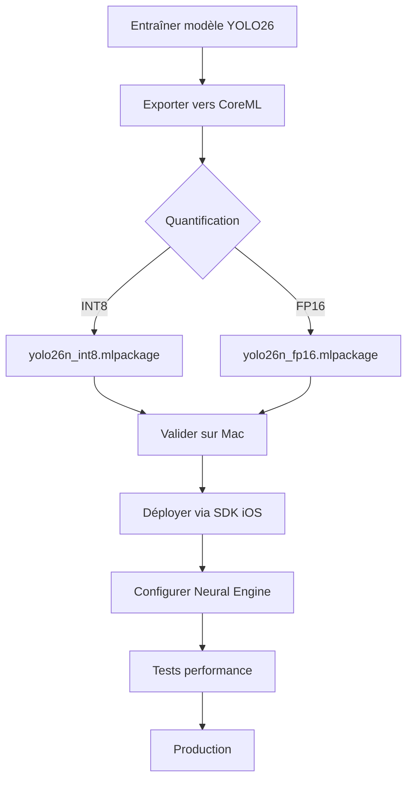

# Déploiement iOS avec CoreML - Guide Complet YOLO26

## Vue d'ensemble

CoreML est le framework d'apprentissage automatique sur appareil d'Apple. Il charge les modèles au format **ML Program** (`.mlpackage`) et les planifie sur le CPU, le GPU et l'**Apple Neural Engine (ANE)** pour une inférence ultra-rapide hors ligne.

### Avantages principaux
- **Vitesse Neural Engine** : YOLO26n s'exécute en **3,8 ms** sur iPhone 17 Pro (Apple A19)
- **End-to-end sans NMS** : YOLO26 n'a pas besoin de post-traitement NMS
- **Privé et hors ligne** : Tous les calculs restent sur l'appareil
- **Multi-plateforme Apple** : iOS, iPadOS, macOS, watchOS, tvOS, visionOS

## Exportation du modèle

### Commandes d'exportation

```python
# Export basique (FP16 par défaut)
from ultralytics import YOLO

model = YOLO("yolo26n.pt")
model.export(format="coreml")  # Crée 'yolo26n.mlpackage'

# Export INT8 (recommandé, correspond aux modèles officiels)
model.export(format="coreml", quantize=8)  # Crée 'yolo26n.mlpackage'

# Export FP16 (pas de perte de précision)
model.export(format="coreml", quantize=16)  # Crée 'yolo26n.mlpackage'

# Export avec entrée dynamique
model.export(format="coreml", dynamic=True)  # Tailles d'entrée variables

# Export pour batch size personnalisé
model.export(format="coreml", batch=4)  # Traite 4 images simultanément
```

```bash
# CLI - Export basique
yolo export model=yolo26n.pt format=coreml

# CLI - Export INT8 quantifié
yolo export model=yolo26n.pt format=coreml quantize=8

# CLI - Export FP16
yolo export model=yolo26n.pt format=coreml quantize=16
```

### Options d'exportation

| Argument | Type | Défaut | Description |
|----------|------|--------|-------------|
| `format` | `str` | `'coreml'` | Format cible pour le modèle exporté |
| `imgsz` | `int` ou `tuple` | `640` | Taille d'entrée (carrée ou `(height, width)`) |
| `quantize` | `int` ou `str` | `None` | Précision : `8` (INT8), `16` (FP16), `32` (FP32) |
| `nms` | `bool` | `False` | Intègre NMS (inutile pour YOLO26) |
| `dynamic` | `bool` | `False` | Autorise des tailles d'entrée dynamiques |
| `batch` | `int` | `1` | Taille du lot d'inférence |
| `device` | `str` | `None` | Appareil : `cpu`, `mps`, ou GPU index |

### Validation et inférence en Python

```python
from ultralytics import YOLO

# Charger le modèle exporté (macOS uniquement)
model = YOLO("yolo26n.mlpackage")

# Inférence
results = model("https://ultralytics.com/images/bus.jpg")

# Validation sur COCO8
metrics = model.val(data="coco8.yaml")
```

## Intégration Swift avec UltralyticsYOLO

### Installation du package Swift

```swift
// Ajouter dans Package.swift ou via Xcode
dependencies: [
    .package(url: "https://github.com/ultralytics/yolo-ios-app", from: "1.0.0")
]
```

### Code Swift - Chargement et inférence simple

```swift
import UltralyticsYOLO
import UIKit

class YOLODetector {
    private var yolo: YOLO?
    
    func loadModel() {
        // Charge le modèle officiel INT8 (téléchargé et mis en cache)
        yolo = YOLO("yolo26n", task: .detect) { result in
            switch result {
            case .success(let model):
                print("Modèle chargé avec succès")
            case .failure(let error):
                print("Erreur de chargement: \(error)")
            }
        }
    }
    
    func detect(image: UIImage) -> YOLOResult? {
        guard let yolo = yolo else { return nil }
        
        // Inférence sur image unique
        let results = yolo(image)
        return results
    }
}
```

### Code Swift - Batch d'inférence

```swift
import UltralyticsYOLO
import UIKit

class YOLOBatchDetector {
    private var yolo: YOLO?
    
    func detectBatch(images: [UIImage]) -> [YOLOResult] {
        guard let yolo = yolo else { return [] }
        
        // Traite plusieurs images en parallèle
        let results = images.compactMap { image in
            return yolo(image)
        }
        return results
    }
    
    func detectWithConfidence(image: UIImage, threshold: Float = 0.5) -> [YOLODetection] {
        guard let yolo = yolo else { return [] }
        
        let results = yolo(image)
        // Filtre les détections par seuil de confiance
        return results?.detections?.filter { $0.confidence > threshold } ?? []
    }
}
```

## Intégration Vision Framework

### Code Swift avec VNCoreMLRequest

```swift
import Vision
import CoreML
import UIKit

class VisionYOLODetector {
    private var model: VNCoreMLModel?
    
    func loadModel() {
        guard let modelURL = Bundle.main.url(forResource: "yolo26n", withExtension: "mlmodelc"),
              let mlModel = try? MLModel(contentsOf: modelURL) else {
            print("Impossible de charger le modèle")
            return
        }
        
        // Configuration pour le Neural Engine
        let config = MLModelConfiguration()
        config.computeUnits = .cpuAndNeuralEngine  // Recommandé pour temps réel
        
        self.model = try? VNCoreMLModel(for: MLModel(contentsOf: modelURL, configuration: config))
    }
    
    func detect(image: CGImage) {
        guard let model = model else { return }
        
        let request = VNCoreMLRequest(model: model) { request, error in
            guard let results = request.results as? [VNRecognizedObjectObservation] else { return }
            
            for observation in results {
                let label = observation.labels.first?.identifier ?? "Inconnu"
                let confidence = observation.confidence
                let bbox = observation.boundingBox
                
                print("Détection: \(label) (\(confidence * 100)%)")
                print("Position: \(bbox)")
            }
        }
        
        // Configurer la requête
        request.imageCropAndScaleOption = .centerFill
        
        // Exécuter
        let handler = VNImageRequestHandler(cgImage: image, options: [:])
        try? handler.perform([request])
    }
}
```

### Optimisation Neural Engine

```swift
import CoreML

class NeuralEngineOptimizer {
    
    func optimizedConfiguration() -> MLModelConfiguration {
        let config = MLModelConfiguration()
        
        // Utiliser .cpuAndNeuralEngine pour les applications caméra
        // Évite les conflits avec le GPU utilisé pour la composition
        config.computeUnits = .cpuAndNeuralEngine
        
        // Pour les tests uniquement (plus lent)
        // config.computeUnits = .cpuOnly
        
        return config
    }
    
    func validateNeuralEngineUsage(model: MLModel) -> Bool {
        // Vérifier que le modèle utilise bien le Neural Engine
        // via les rapports de performance Xcode
        return true
    }
}
```

## Capture caméra et inférence temps réel

### Code Swift - AVCaptureSession avec YOLO

```swift
import AVFoundation
import UltralyticsYOLO
import UIKit

class RealTimeYOLODetector: NSObject, AVCaptureVideoDataOutputSampleBufferDelegate {
    private let captureSession = AVCaptureSession()
    private let videoOutput = AVCaptureVideoDataOutput()
    private var yolo: YOLO?
    private let processingQueue = DispatchQueue(label: "com.yolo.processing")
    
    func setupCamera() {
        captureSession.sessionPreset = .high
        
        guard let camera = AVCaptureDevice.default(.builtInWideAngleCamera, for: .video, position: .back),
              let input = try? AVCaptureDeviceInput(device: camera) else {
            print("Caméra non disponible")
            return
        }
        
        captureSession.addInput(input)
        
        videoOutput.videoSettings = [
            kCVPixelBufferPixelFormatTypeKey as String: kCVPixelFormatType_32BGRA
        ]
        videoOutput.setSampleBufferDelegate(self, queue: processingQueue)
        videoOutput.alwaysDiscardsLateVideoFrames = true
        
        captureSession.addOutput(videoOutput)
        captureSession.startRunning()
    }
    
    func loadYOLO() {
        yolo = YOLO("yolo26n", task: .detect) { result in
            if case .success(let model) = result {
                print("Modèle temps réel chargé")
            }
        }
    }
    
    func captureOutput(_ output: AVCaptureOutput, 
                      didOutput sampleBuffer: CMSampleBuffer, 
                      from connection: AVCaptureConnection) {
        guard let imageBuffer = CMSampleBufferGetImageBuffer(sampleBuffer),
              let yolo = yolo else { return }
        
        // Convertir en UIImage
        let ciImage = CIImage(cvImageBuffer: imageBuffer)
        let context = CIContext()
        guard let cgImage = context.createCGImage(ciImage, from: ciImage.extent) else { return }
        let image = UIImage(cgImage: cgImage)
        
        // Inférence YOLO
        let results = yolo(image)
        
        // Traiter les résultats sur le thread principal
        DispatchQueue.main.async {
            self.processResults(results)
        }
    }
    
    private func processResults(_ results: YOLOResult?) {
        guard let results = results else { return }
        
        // Dessiner les boîtes de détection sur l'interface
        // Mettre à jour les overlays, labels, etc.
    }
}
```

### Configuration du flux caméra

```swift
extension RealTimeYOLODetector {
    
    func configureOptimalResolution() {
        // Résolution optimale pour YOLO (640x640)
        captureSession.beginConfiguration()
        
        // Sélectionner la meilleure résolution
        if captureSession.canSetSessionPreset(.hd1920x1080) {
            captureSession.sessionPreset = .hd1920x1080
        } else if captureSession.canSetSessionPreset(.hd1280x720) {
            captureSession.sessionPreset = .hd1280x720
        }
        
        captureSession.commitConfiguration()
    }
    
    func optimizeForRealTime() {
        // Réduire la latence
        videoOutput.alwaysDiscardsLateVideoFrames = true
        
        // Utiliser le thread de priorité haute
        processingQueue.qos = .userInitiated
    }
}
```

## Caractéristiques de performance

### Benchmarks par modèle iPhone

| Modèle | Tâche | Taille | CPU (ms) | Neural Engine (ms) |
|--------|-------|--------|----------|-------------------|
| YOLO26n | Détection | 640 | 9.1 | **3.8** |
| YOLO26n-seg | Segmentation | 640 | 12.3 | **4.8** |
| YOLO26n-sem | Sémantique | 1024 | 21.8 | **12.1** |
| YOLO26n-cls | Classification | 224 | 2.2 | **2.0** |
| YOLO26n-pose | Pose | 640 | 12.0 | **3.8** |
| YOLO26n-obb | OBB | 1024 | 21.7 | **7.2** |

### Temps réel caméra
- **YOLO26n detect** : ~16 ms/image en mode caméra en direct
- **iPhone 17 Pro (Apple A19)** : Excellent pour temps réel
- **iPhone 15/16** : Bonnes performances avec modèles nano
- **iPhone 13/14** : Utiliser des modèles plus petits

### Optimisations recommandées

```swift
class PerformanceOptimizer {
    
    func optimizeForDevice() {
        // Détecter le modèle d'iPhone
        let deviceInfo = ProcessInfo.processInfo
        
        // iPhone récent (A15+)
        if #available(iOS 15.0, *) {
            // Utiliser Neural Engine
        } else {
            // Fallback CPU
        }
    }
    
    func reduceMemoryFootprint() {
        // 1. Utiliser des modèles quantifiés INT8
        // 2. Réduire la résolution d'entrée si nécessaire
        // 3. Libérer les ressources entre les inférences
    }
}
```

## Problèmes courants et solutions

### 1. Erreur "MLIR pass manager failed"

**Cause** : `ComputeUnit.ALL` ou `CPU_AND_GPU` sur macOS
**Solution** :
```swift
let config = MLModelConfiguration()
config.computeUnits = .cpuAndNeuralEngine  // Utiliser ce paramètre
```

### 2. Latence trop élevée

**Causes possibles** :
- GPU utilisé pour composition caméra
- Modèle trop volumineux
- Résolution d'entrée trop élevée

**Solutions** :
```swift
// 1. Exclure le GPU pour l'inférence
config.computeUnits = .cpuAndNeuralEngine

// 2. Utiliser un modèle plus petit
let model = YOLO("yolo26n", task: .detect)  // nano

// 3. Réduire la résolution
let config = MLModelConfiguration()
// Ajuster imgsz lors de l'exportation
```

### 3. Modèle non trouvé

**Solution** :
```swift
// Vérifier que le fichier .mlpackage est dans le bundle
// Ou télécharger le modèle
let modelURL = URL(string: "https://github.com/ultralytics/yolo-ios-app/releases")
```

### 4. Mauvaise précision après quantification

**Solution** :
```python
# Valider avant le déploiement
from ultralytics import YOLO
model = YOLO("yolo26n_int8.mlpackage")
metrics = model.val(data="coco8.yaml")
```

### 5. Problèmes de mémoire

**Solution** :
```swift
// Libérer les ressources
class MemoryManager {
    private var lastInferenceTime: Date?
    
    func cleanupIfNeeded() {
        if let lastTime = lastInferenceTime,
           Date().timeIntervalSince(lastTime) > 5.0 {
            // Nettoyer les caches
            URLCache.shared.removeAllCachedResponses()
        }
    }
}
```

## Flux de travail recommandé



## Ressources utiles

- [SDK Ultralytics YOLO iOS](https://github.com/ultralytics/yolo-ios-app)
- [Plugin Flutter](https://github.com/ultralytics/yolo-flutter-app)
- [Guide Apple CoreML](https://developer.apple.com/documentation/coreml/integrating-a-core-ml-model-into-your-app)
- [Documentation coremltools](https://apple.github.io/coremltools/docs-guides/)
